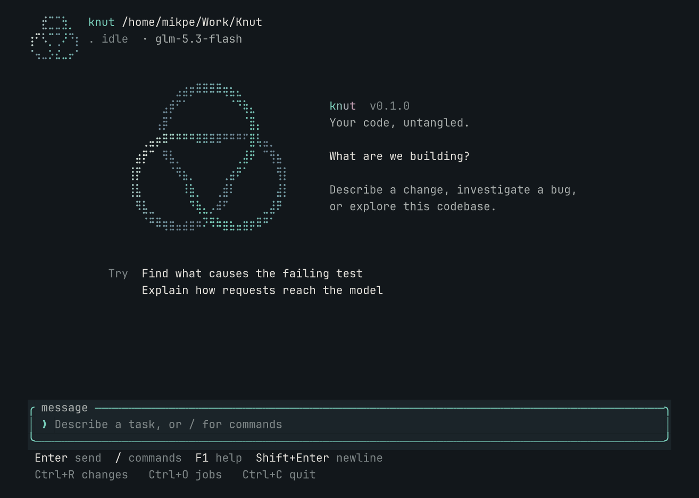

# Terminal guide

Run `knut` or `knut tui` in the working directory. The main screen contains a
conversation, a compact status line and an input that grows with the draft.
Changes, jobs and decision details open on demand.

## Tasks and approvals

Enter submits a task. While work runs, Enter queues a separate task; **Alt+S**
changes the current draft between queueing and steering. Steering adds a
correction to the active goal. Successful completion starts the next queued
task; failure or cancellation holds the queue. Open jobs to edit, remove or
explicitly start held requests. Acknowledgements arrive at a runtime boundary.

An approval opens a scrollable preview of the exact action, replacement text,
read hash and full arguments. **Alt+A** allows it; **Alt+D** denies it.
**Alt+V** toggles the preview and **PgUp/PgDn** scrolls it. Enter during a pending
approval preserves the draft unless steering was explicitly selected.

Changes review is read-only. **Left/Right** chooses a file, **Up/Down** chooses
a hunk and **PgUp/PgDn** scrolls. The command menu also provides checks, setup
diagnostics, pause, resume and cancel.

## Shortcuts

| Key | Action |
| --- | --- |
| Enter | Send a task, answer a question or queue during work |
| Shift+Enter / Ctrl+J | New line |
| Up / Down | Move through input lines; recall history at its edges |
| Ctrl+A / Ctrl+E | Start / end of the input line |
| Ctrl+Left / Right or Alt+B / F | Move by word |
| Ctrl+W or Alt+Backspace | Delete the previous word |
| Ctrl+Z / Ctrl+Y | Undo / redo |
| `/` at empty input, Ctrl+P or Ctrl+K | Search commands; arrows select, Enter runs |
| F2 | Connection settings |
| Ctrl+R | Changes and checks |
| Ctrl+O | Jobs and queued requests |
| Alt+S | Switch the draft between queue and steer during work |
| Up / Down in jobs | Select a queued request |
| Alt+E / Alt+X in jobs | Edit / remove the selected request |
| Alt+R in jobs | Start the selected request when idle |
| Ctrl+B | Decision details |
| PgUp / PgDn | Scroll the conversation or current detail view |
| Tab / Shift+Tab | Switch input and conversation navigation |
| Esc | Close a detail view or return to the latest output |
| Alt+A / Alt+D | Allow / deny the exact pending approval |
| Alt+V | Toggle the pending-action preview |
| Ctrl+C | Close an overlay, stop work, clear an idle draft or exit |
| Ctrl+D | Exit when idle with an empty draft |
| Ctrl+Q | Save the draft and exit when idle |
| `?` at empty input / F1 anytime | Shortcut help |

## Drafts and history

Drafts, cursor positions and recent prompt history survive restarts in the same
workspace. Input saves in the background every 400 ms and flushes on normal
exit. Ctrl+Q keeps the draft for next time. History browsing preserves the
unfinished draft and cursor; bracketed paste is one undoable edit, normalizes
Windows newlines and reports truncation.

The store is `$XDG_DATA_HOME/knut/sessions.db`, normally
`~/.local/share/knut/sessions.db`, or the path in `KNUT_SESSION_STORE`. It uses
owner-only file permissions. History retains up to 100 prompts within a
one-million-character budget. Storage errors and conflicting saves from another
terminal are reported. Input memory does not resume tasks, queue edits or approvals.

## Appearance

Color detection supports truecolor, 256 colors, 16 colors and `NO_COLOR`.
`KNUT_TUI_COLORS=truecolor|256|16|none` overrides detection, including `NO_COLOR`.
Use `/motion` or `KNUT_TUI_MOTION=off` for reduced motion; `TERM=dumb` uses a
static ASCII mark. The knot animation settles while waiting for approval or
after the introduction. The terminal is restored on exit.

See [development checks](development.md#checks) for repeatable terminal smoke runs.
